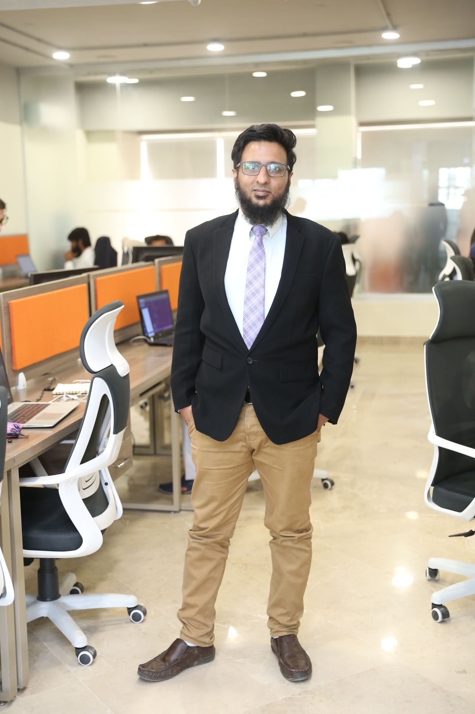

<!-- 
  Replace `./asad.jpg` with the path or URL to your actual image. 
  If your image is in the root of the repository, you can use `./asad.jpg`.
  If it's hosted elsewhere, use the full URL (e.g., `https://example.com/asad.jpg`).
-->

<h1 align="center">🌟 Asad Zubair Bhatti 🌟</h1>
<h5 align="center">Welcome to my Portfolio!</h5>

<a href="https://drive.google.com/file/d/1tkGrEbgiNbKdo_wv-I5hKbRnn-kpO7HE/view?usp=sharing"><strong>Click here to view/download my resume</strong></a>
 

  

## Table of Contents
- [Introduction](#introduction)
- [My Work](#my-work)
- [Contact](#contact)

## Introduction

Hello! My name is **Asad Zubair Bhatti**. Welcome to my portfolio repository. Here, I’ll be showcasing some of my work, including both client projects and personal (hobby) projects. Feel free to explore, and don't hesitate to [get in touch](mailto:bhatti.asad99@gmail.com) if you have any questions.

**Key Skills**
- Full Stack Development
- Project Planning & Governance
- Strategy

**Programming Languages**
-  JavaScript
-  TypeScript
-  Python

---

[← Back to Table of Contents](#table-of-contents)
## My Work
| Project Title | Summary | Case Study URL | Demo URL | Type |
|---------------|-------------|----------------|------------|------|
| Zown | Real Estate Company Also offering Down Payment Assistance ~ **Daily 1000 users** |  [Case Study & Further Details](docs/zown.md) | [Live Project](https://zown.ca/) | `Professional` |
| Madinah | A Crowdfunding Platform ~ **Monthly 10K Users** |   [Case Study & Further Details](docs/madinah.md) | [Live Project](https://madinah.com/) | `Professional` |
| Octilearn | EdTech Notes & Exam Preparation Platform |  | [Live Project](https://octilearn.com/) | `Professional` |
| Yamar | Holiday Planning Website |   | [Live Project](https://yamar.vercel.app/) | `Professional` |
| Bulky | Handyman Services Platform |  | [Live Project](https://bulky-peach.vercel.app/) | `Professional` |
| Aqers | Real Estate Marketplace - UI Development Only |  | [Live Project](https://aqers.vercel.app/) | `Professional` |
| Cynthia Ugwu Clone |  | | [Live Project](https://cynthiagwu-clone-2.vercel.app/) | `Hobby` |
| Mulk Investment | Real Estate Investment Platform | [Case Study & Further Details](docs/minv.md) |   | `Professional` |
| JobTask | Handyman Services Business |  [Case Study & Further Details](docs/jobtask.md) |  | `Professional` |
| Sentratainment | Travel Entertainment App |  [Case Study & Further Details](docs/sentratainment.md) |  | `Professional` |
| Nomadiq | Tenants Management Portal |  [Case Study & Further Details](docs/nomadiq.md) |  | `Professional` |
| Nisa Nursing Home | Hospital Internal ERP |  [Case Study & Further Details](docs/nisa-erp.md) |  | `Professional` |
| Buddy | Software Company ERP |  [Case Study & Further Details](docs/buddy.md) |  | `Professional` |
| E-Signature | E-Signature Tool |  [Case Study & Further Details](docs/esig.md) |  | `Professional` |
| Hajj App | Whatsapp Bot for guiding Hajis |  [Case Study & Further Details](docs/hajj.md) |  | `Professional` |
| Postal 247 | Food Ordering Platform App |  [Case Study & Further Details](docs/postal-247.md) |  | `Professional` |
| Block App | Fitness & Workout Planning App for Athletes |  [Case Study & Further Details](docs/block.md) |  | `Professional` |

Thank you for visiting! 
If you’d like to know more or discuss potential collaborations, feel free to [reach out!](mailto:bhatti.asad99@gmail.com).
