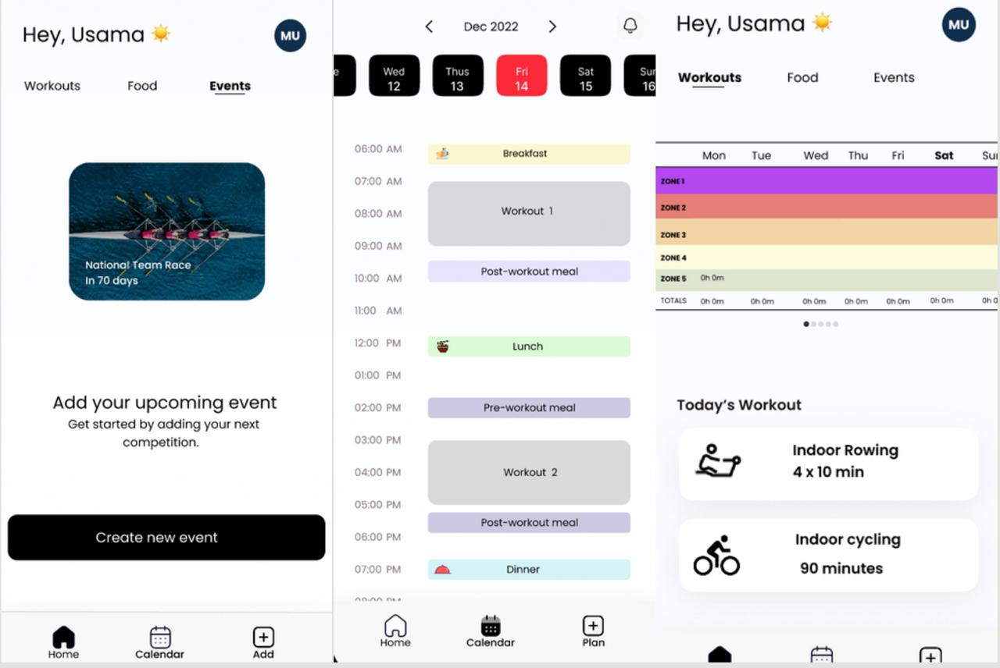

[⬅ Back to All Projects](../README.md#my-work)

# 📌 Block App

---

## 📖 Table of Contents  

- [📖 Summary](#-summary)  
- [🌐 Demo URL](#-demo-url)  
- [🏷 Type](#-type)  

---
[Back to Table of Contents](#-table-of-contents)
## 📖 Summary  

Block App is a mobile app developed for athletes to create custom diet and workout plans tailored to events they register in for competitions. This platform had a frontend mobile app developed in React Native, a backend developed in Express and MongoDB and exposed an **external API where coaches uploaded their excel files** which were converted into Fitness plans for the athletes

**Key Features:**
- ✔️ **Detailed & Tailored Workout Plans**
- ✔️ **Custom Diet Plans** 
- ✔️ **Upcoming Event Planning and Weight Target Setting** 



**Technologies:** 
-  MS Excel Scripting
-  React Native JS
-  Node JS
-  MongoDB JS
-  ExpressJS JS
-  TypeScript
-  MUI/Material UI v5

---
[Back to Table of Contents](#-table-of-contents)
## 🏷 Type  

🛠 **Project Type:** `Professional` 

---

🚀 *Thanks for checking out this project! Feel free to contribute or [reach out](mailto:bhatti.asad99@gmail.com) for any queries.*  
```
