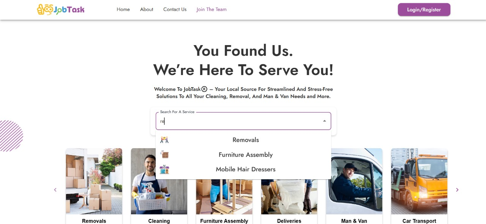

[⬅ Back to All Projects](../README.md#jobtask-uk-ltd)

# 📌 JobTask UK Ltd.

---

## 📖 Table of Contents  

- [📖 Summary](#-summary)  
- [📑 Case Study](#-case-study)  
- [🌐 Demo URL](#-demo-url)  
- [🎥 Video Walkthrough](#-video-walkthrough)  
- [🖼 Images](#-images)  
- [🔗 GitHub Repository](#-github-repository)  
- [🏷 Type](#-type)  

---

## 📖 Summary  

**Introduction**

JobTask is a handyman service business offering removals, cleaning, furniture assembly, and deliveries through a digital platform. The existing system faced challenges such as an outdated UI, inconsistent code, project delays, and a lack of scalability. Our team revamped the platform to enhance performance, user experience, and maintainability.

**Key Features & Improvements**

- **UI/UX Redesign:** Created a modern, user-friendly interface with a professional layout.
- **Technology Upgrade:** Migrated from React.js to Next.js for better performance and SEO.
- **Payment Integration:** Implemented Stripe for secure online transactions.
- **Real-Time Features:** Used Socket.io for live chat between users and service providers.
- **Authentication Security:** Integrated Vonage (Nexmo) OTP for user verification.
- **Codebase Refinement:** Refactored and standardized the code, ensuring easier maintenance and future development.

**Technologies Used**

-  React JS
-  Next JS
-  Node JS
-  MongoDB JS
-  ExpressJS JS
- -  MUI/Material UI v5
-  TypeScript
- AWS Services
  -  AWS EC2
  -  AWS Amplify
  -  AWS Route 53
-  GoDaddy
-  Vonage
-  Stripe

---



---

## 📑 Case Study  

### 🔥 Business Challenge  

JobTask, a handyman service platform (for removals, cleaning, furniture assembly, deliveries, etc.), was facing major challenges:  

🔴 **Poor Design:** The outdated UI lacked professionalism, reducing user trust and engagement.  
🔴 **Project Overruns:** The previous development team consistently missed deadlines, causing delays and cost overruns.  
🔴 **Code Inconsistencies:** Multiple developers with varying styles left the codebase unstructured and difficult to maintain.  
🔴 **Lack of Code Reviews:** Without proper reviews, the code turned into "spaghetti code," making debugging and scaling hard.  

### 💡 Our Solution  

Our team (1 designer & 2 developers) systematically tackled these issues:  

✅ **Technology Upgrade:** Migrated frontend from **React.js → Next.js** for improved SEO and faster page loads.  
✅ **UI/UX Overhaul:** Redesigned the interface with a modern landing page, About Us section, and improved navigation.  
✅ **Codebase Refinement:** Refactored and optimized the entire codebase, enforcing coding standards and removing redundant code.  
✅ **Payment Integration:** Integrated **Stripe** for secure transactions, ensuring PCI compliance and user trust.  
✅ **Comprehensive Documentation:** Created setup guides, API references, and code documentation for future scalability.  

### 👥 Team Setup  

👨‍🎨 **1 Designer** – Focused on UI/UX redesign, improving aesthetics and user journey.  
👨‍💻 **2 Developers** – Integrated Next.js frontend with the backend, added new APIs, and implemented third-party services.  
  
### 📊 Results & Impact  

🚀 **Faster Load Time:** Next.js optimization significantly reduced load time, improving user experience.  
🛠 **Cleaner Codebase:** Refactoring and structured development allow easier debugging and feature expansion.  
💡 **Enhanced User Experience:** The intuitive UI/UX led to increased engagement and positive user feedback.  
📈 **Better Scalability:** The new architecture supports future growth, making it easy to expand features.  

---

## 🎥 Video Walkthrough  

▶ **Watch the Walkthrough:** [Click here to View the Complete App Walkthrough](https://drive.google.com/file/d/1jNTe1czXnS2xZpKDQoAzWaYydrLWtxhR/preview)  

*(A short video demonstrating key features.)*  

---

## 🏷 Type  

🛠 **Project Type:** `Professional`   

---

🚀 *Thanks for checking out this project! Feel free to contribute or [reach out](mailto:bhatti.asad99@gmail.com) for any queries.*  
```
