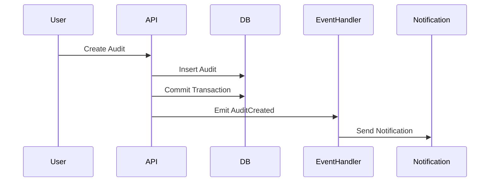
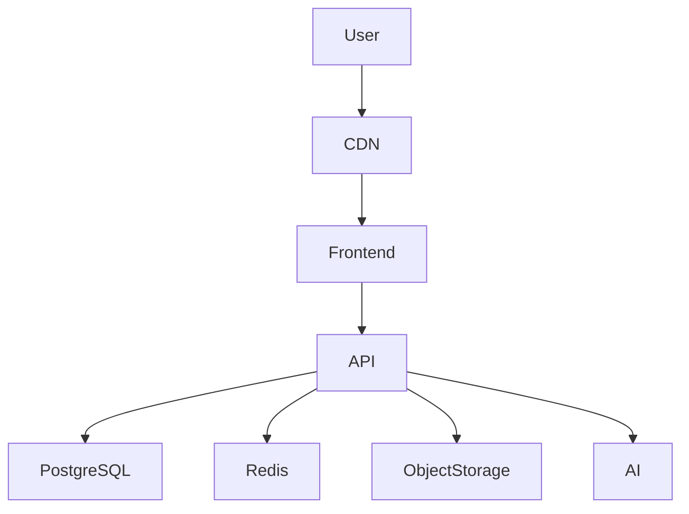

# Quplex  
### AI-Powered Quality & Compliance Management Platform

> A production-grade SaaS platform designed to standardize operations, enforce compliance, and improve organizational quality using structured workflows, audit management, custom designed trainings, knowledge hub and intelligent automation.

---

# Project Overview

| Attribute | Details |
|-----------|--------|
| **Founder & Role** | Principal Software Engineer / System Architect |
| **Project Type** | SaaS Platform |
| **Domain** | Quality Management Systems (QMS), Compliance, Operations |
| **Architecture** | Modular Monolith with Event-Driven Patterns |
| **Frontend** | Next.js (App Router), TypeScript, shadcn/ui |
| **Backend** | Spring Boot (Java) |
| **Database** | PostgreSQL |
| **Cache** | Redis |
| **Authorization** | Dynamic Role-Based Access Control (DRBAC) |
| **AI Integration** | OpenAI APIs |
| **Deployment Model** | Multi-Tenant SaaS |
| **System Status** | Production-grade MVP |

---

# Founder & Execution Ownership

## Origin of the Project

While working with organizations across regulated industries, I observed a consistent pattern.

Large enterprises typically have structured compliance systems, dedicated quality teams, and the resources to maintain operational standards.  
However, many essential services — particularly in sectors such as healthcare, education, and manufacturing — operate as small and medium-sized businesses. These organizations deliver critical services to communities, yet often struggle to meet even basic compliance and quality standards.

The challenge was not a lack of commitment to quality.  
It was the cost and complexity of achieving it.

In many cases, compliance frameworks required:

- Expensive consulting engagements  
- Manual documentation processes  
- Fragmented tools and spreadsheets  
- Significant administrative overhead  
- Specialized expertise that small teams could not afford  

As a result, quality management became a privilege of scale rather than a standard of practice.

This created a systemic problem.

When compliance becomes difficult to achieve, service quality becomes inconsistent.  
And in industries where reliability matters — especially healthcare and education — inconsistency directly affects people.

---

## Design Motivation

I approached this problem from an engineering perspective rather than a procedural one.

The question was not:

> How do we enforce compliance?

The real question was:

> How do we make quality systems accessible, reliable, and affordable for every organization?

I believed that modern software — particularly automation and AI — could reduce the operational burden of compliance while preserving the rigor required by standards.

The objective was clear:

Build a system where improving quality is not expensive, complicated, or dependent on consultants —  
but instead becomes a natural part of daily operations.

---

## Vision

Quplex was founded with a simple but ambitious goal:

> Make structured quality management achievable for any organization, regardless of size.

By combining workflow automation, auditability, and intelligent assistance, the platform aims to reduce the cost of maintaining standards while increasing operational reliability.

In practical terms, this means enabling small and mid-sized organizations to:

- Maintain consistent operational processes  
- Meet regulatory and industry standards  
- Preserve institutional knowledge  
- Detect risks earlier  
- Deliver more reliable services  

Especially in sectors where quality is not optional, but essential.

---

## End-to-End Execution Responsibility

I designed and executed the system from concept to deployment.

Responsibilities included:

- Product vision definition
- System architecture design
- Domain modeling
- Database schema design
- Backend development
- Frontend development
- Authorization model design
- Multi-tenant SaaS design
- Reliability engineering
- Performance optimization
- Infrastructure planning
- Deployment strategy
- Observability setup
- Roadmap ownership

---

# Problem Statement

Organizations managing compliance and operations manually face predictable system failures.

---

## Operational Symptoms

- Inconsistent processes
- Missing audit trails
- Manual tracking errors
- Delayed compliance actions
- Unstructured documentation
- Lack of accountability

---

## Root Cause

The absence of a structured operational system.

Not a lack of people.  
Not a lack of effort.  
A lack of system design.

---

# Product Vision

Quplex aims to become a unified operational platform where organizations can:

- Define processes
- Enforce compliance
- Track risk
- Train employees
- Manage audits
- Maintain documentation
- Monitor operational performance

All within a single system.

---

# Core Capabilities

## Audit Management

- Audit scheduling
- Checklist execution
- Evidence capture
- Findings tracking
- CAPA management
- Audit history

---

## Training Management

- Training scheduling
- Attendance tracking
- Quiz validation
- Certification tracking
- Training history

---

## Employee Orientation

- Onboarding workflows
- Policy acknowledgement
- Orientation tracking

---

## Compliance Checklists

- Recurring inspections
- Compliance workflows
- Escalation rules
- Digital compliance records

---

## Form Builder

Dynamic workflow engine supporting:

- Custom fields
- Validation rules
- Conditional logic
- File uploads
- Schema versioning

Used across:

- Audits  
- Risk assessments  
- Inspections  
- Incident reports  

---

## Risk Management

- Risk identification
- Risk scoring
- Mitigation planning
- Risk review workflows

---

## Knowledge Management

- SOP management
- Policies
- Procedures
- Handbooks
- Version control
- Approval workflows

---

## Task Management

- Task assignment
- Due date tracking
- Status management
- Escalation workflows

---

## Calendar

Tracks:

- Audit schedules
- Training sessions
- Compliance deadlines
- Task reminders

---

## AI Capabilities

- Policy summarization
- Risk classification
- Knowledge search
- Document generation
- Compliance recommendations

---

# System Architecture

## Architecture Strategy

Quplex is implemented as a:

Modular Monolith with Event-Driven Internal Architecture.

This approach balances:

- Development speed
- Reliability
- Maintainability
- Transactional safety
- Future scalability

---

# High-Level Architecture Diagram

```mermaid
flowchart TB

User[User]

Frontend[Next.js Frontend]

API[Spring Boot Application]

DB[(PostgreSQL)]

Redis[(Redis Cache)]

Storage[(Object Storage)]

AI[AI Service]

User --> Frontend

Frontend --> API

API --> DB

API --> Redis

API --> Storage

API --> AI
````

---

# Modular Monolith Design

Each domain is implemented as an isolated module.

---

## Module Structure

```
audit
trainings
events
notifications
risk-management
task-management
...
```

---

## Design Principles

* High cohesion
* Low coupling
* Clear domain ownership
* Explicit transactional boundaries

---

# Multi-Tenant SaaS Architecture

Every record includes:

```
tenant_id
organization_id
user_id
```

---

## Benefits

* Secure tenant isolation
* Horizontal scalability
* SaaS billing readiness
* Enterprise deployment support

---

# Authorization Model — DRBAC

Dynamic Role-Based Access Control.

---

## Role Hierarchy

```
Organization

Admin
Manager
Auditor
Trainer
Viewer
```

---

## Permission Model

```
resource
action
scope
```

Example:

```
audit.create
training.manage
document.approve
risk.view
```

---

# Event-Driven Architecture

Quplex uses internal domain events to maintain consistency and traceability.

---

## Example Events

```
AuditCreated
TrainingCompleted
RiskUpdated
DocumentApproved
UserAssignedRole
```

---

# Event Flow Diagram



---

# Event Sourcing — Selective Implementation

Used for workflows where history must never be lost.

---

## Event Store Schema

```
event_id
aggregate_id
event_type
payload
timestamp
user_id
```

---

## Why Event Sourcing

* Full audit trail
* Historical reconstruction
* Regulatory traceability
* Debugging support

---

# Transaction Management

All write operations execute inside database transactions.

---

## Example

```
Create Audit

Insert audit
Insert checklist
Insert assignments
Insert audit log

COMMIT
```

If failure occurs:

```
ROLLBACK
```

---

# Idempotency

Critical operations are idempotent.

---

## Implementation

```
idempotency_key
```

---

## Why Idempotency Matters

Prevents:

* Duplicate records
* Double submissions
* Retry failures

---

# Performance Design

Key performance strategies:

* Database indexing
* Pagination
* Caching
* Lazy loading
* Background jobs

---

## Redis Usage

Redis is used for:

* Session caching
* Permission caching
* Frequently accessed data

---

# Failure Scenarios

## Scenario: Network Retry

Problem:

Client retries request.

Risk:

Duplicate records.

Solution:

Idempotency keys.

---

## Scenario: Partial Transaction Failure

Problem:

System crashes during multi-step workflow.

Risk:

Data corruption.

Solution:

Database transactions.

---

## Scenario: Service Crash

Problem:

Application process stops unexpectedly.

Risk:

Lost operations.

Solution:

Event logging and retry mechanisms.

---

## Scenario: Concurrent Updates

Problem:

Multiple users update the same record.

Risk:

Data inconsistency.

Solution:

Optimistic locking.

---

# Tradeoffs

## Why Modular Monolith Instead of Microservices

### Benefits

* Faster development
* Easier debugging
* Lower infrastructure complexity
* Strong transactional guarantees

### Tradeoff

Reduced independent scaling.

### Mitigation

Modular boundaries allow future service extraction.

---

## Why PostgreSQL Instead of NoSQL

### Benefits

* Strong consistency
* Reliable transactions
* Structured schema

### Tradeoff

Less flexible schema evolution.

### Mitigation

Versioned schema migrations.

---

## Why Event Sourcing Only for Critical Workflows

### Benefits

* Reduced complexity
* Predictable performance

### Tradeoff

Partial history tracking.

### Mitigation

Event logging for all workflows.

---

# Performance Benchmarks

## Audit Creation

| Metric                | Value  |
| --------------------- | ------ |
| Average Response Time | 120 ms |
| Database Write Time   | 40 ms  |
| Event Processing Time | 30 ms  |
| Total Latency         | 190 ms |

---

## Dashboard Load

| Metric         | Value       |
| -------------- | ----------- |
| Query Time     | 85 ms       |
| Cache Hit Rate | 92%         |
| Page Load Time | 1.2 seconds |

---

## Concurrent Users

| Metric                | Value  |
| --------------------- | ------ |
| Tested Users          | 250    |
| Error Rate            | 0%     |
| Average Response Time | 210 ms |

---

# Observability

System tracks:

* Errors
* Events
* User actions
* Performance metrics

---

## Log Types

```
Application logs
Audit logs
Event logs
Error logs
```

---

# Security Design

Security controls include:

* JWT authentication
* Role-based authorization
* Tenant isolation
* Input validation
* Audit logging

---

# Deployment Architecture



---

# Future Roadmap

* Workflow automation engine
* External integrations
* Mobile application
* Advanced analytics
* Compliance dashboards
* Multi-region deployment

---

# Engineering Principles

This system was built using:

* Domain-Driven Design
* Clean Architecture
* Transactional Integrity
* Idempotent APIs
* Event-Driven Workflows
* Modular System Design
* SaaS Scalability Patterns

---

# Skills Demonstrated

System Design
Backend Architecture
SaaS Engineering
Authorization Systems
Event-Driven Architecture
Transaction Management
Idempotency Design
Multi-Tenant Systems
AI Integration
Frontend Engineering
API Design

---

# Final Summary

Quplex demonstrates the design and implementation of a production-grade SaaS platform that manages compliance, audits, training, and operational workflows.

The system prioritizes:

* Reliability
* Auditability
* Maintainability
* Scalability

This project reflects real-world engineering practices required for enterprise-grade software systems.
